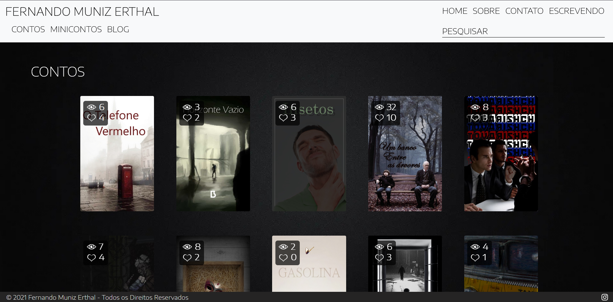

# ✍️ Personal Writing Website

**Personal website to publish my short stories and flash fiction.**  
Built using modern web technologies for performance, scalability, and ease of publishing.

---

## 🚀 Technologies Used

- **CSS** – Custom styling
- **Angular 9** – Frontend framework
- **Firebase Hosting** – Static site hosting
- **Firebase Firestore** – Real-time database for storing stories and comments

---

## 📸 Features

- 🔍 **Search and filter** Search and filter stories
- 📱 **Layout** Responsive layout for mobile and desktop 
- 💬 **Story comments** – Readers can leave comments on each story
- 🖊️ **Publish and Manage** Publish and manage short stories and flash fiction
- 🔍 **Keyword filter search** – Readers can search stories using keywords and tags
- 🔠 **Font size control** – Readers can increase or decrease text size for accessibility
- 📬 **Contact section via email** – Readers can get in touch through a contact form or email
- 🌗 **Dark and light reading modes** – Switch between light and dark themes for better reading experience
- 📤 **Shareable stories** – Stories and selected excerpts can be shared by readers with images to social medias