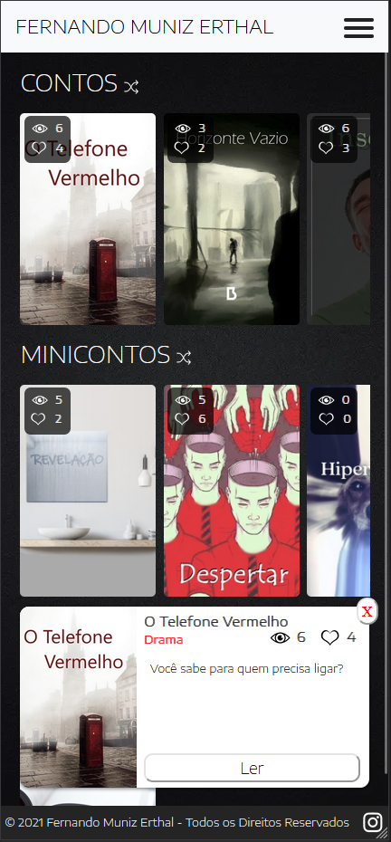
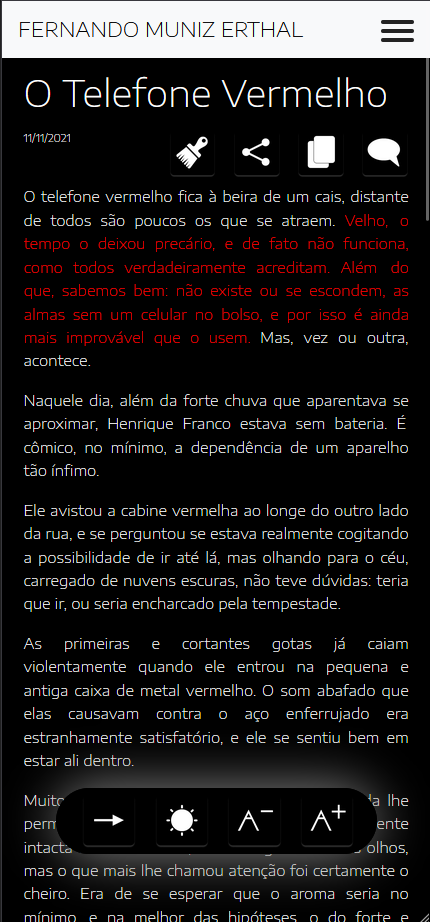
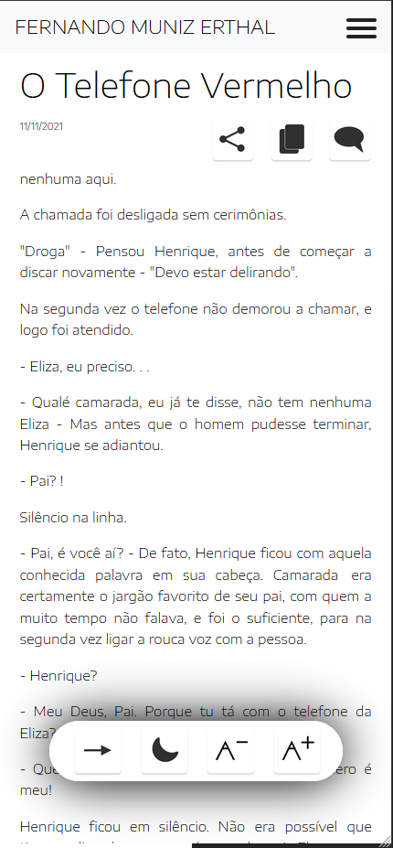
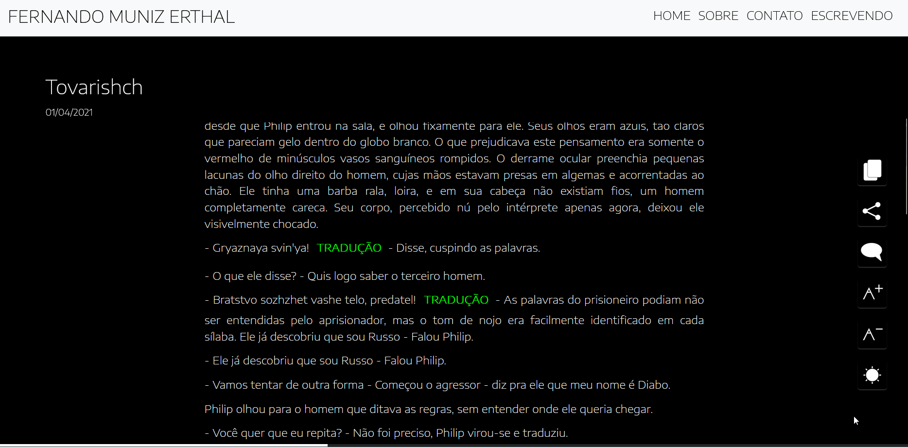
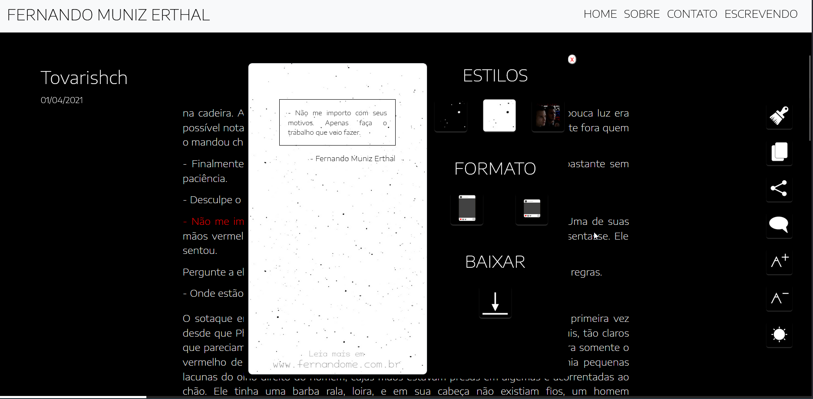

# ✍️ Personal Writing Website

**Personal website to publish my short stories and flash fiction.**  
Built using modern web technologies for performance, scalability, and ease of publishing.

> 🗓️ **Project developed in 2021**

[🌐 Check out my short story site](https://contos.fernandome.com)

---

## 🚀 Technologies Used

- **CSS** – Custom styling
- **Angular 9** – Frontend framework
- **Firebase Hosting** – Static site hosting
- **Firebase Firestore** – Real-time database for storing stories and comments

---

## 📸 Features

- 🔍 **Search and filter** Search and filter stories
- 📱 **Layout** Responsive layout for mobile and desktop 
- 💬 **Story comments** – Readers can leave comments on each story
- 🖊️ **Publish and Manage** Publish and manage short stories and flash fiction
- ⏱️ **Estimated reading time** – Shows how much time is left to finish the story
- 🔍 **Keyword filter search** – Readers can search stories using keywords and tags
- 🔠 **Font size control** – Readers can increase or decrease text size for accessibility
- 📬 **Contact section via email** – Readers can get in touch through a contact form or email
- 🌗 **Dark and light reading modes** – Switch between light and dark themes for better reading experience
- 📤 **Shareable stories** – Stories and selected excerpts can be shared by readers with images to social medias
---

<a href="https://fernandome.com" target="_blank">🌐 Portfólio</a>

---

## 📸 Screenshots

  
  
  
  

